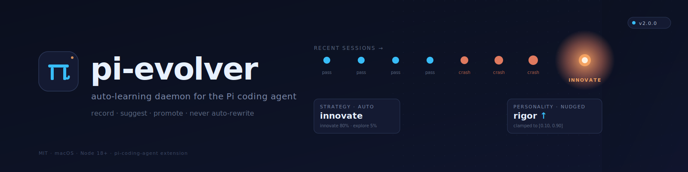

<p align="center">
  
</p>

<p align="center">
  <a href="LICENSE"></a>
  
  
  
  
</p>

> Give your coding agent a memory, a mood, and a sense of when to change
> strategy — without letting it rewrite itself.

**pi-evolver** is a small auto-learning daemon that sits beside the
[Pi coding agent](https://github.com/mariozechner/pi-coding-agent). It
watches every session, records *metadata only* (no prompts, no tool
content), and writes a rolling digest that Pi reads on startup. After a few
weeks it quietly spots patterns — _"you've hit the same error four times
this week"_ — and offers a one-command path to turn that into a permanent
skill.

It will never modify your code, your prompts, or its own behavior
autonomously. That's the whole point.

---

## Why this exists

Coding agents don't have memory across sessions. You hit the same bug
on Monday, debug it, solve it; on Friday the agent walks into the same
footgun because nothing remembered what happened. Pi is great, but
each session starts fresh.

At the other end of the spectrum, "self-evolving" agent projects try
to close that gap by letting the agent rewrite its own prompts and
skills autonomously. The pattern most of them fall into is the same:
silent drift compounding across hundreds of sessions until something
important breaks and nobody knows why.

pi-evolver is the middle path. It is **auto-learning, manual promotion**:

- The daemon records what happened and suggests what to do next.
- The model reads those suggestions as part of its system prompt.
- Turning a recurring pattern into a permanent skill takes one command
  and one human glance. No silent self-modification.

The only thing that ever changes automatically is a five-float
"personality" vector, clamped to `[0.10, 0.90]` and bounded to ±0.05
per session with every change logged. Everything else requires you to
type a command.

---

## What it actually does

```
 ┌───────────────────────────────┐      ┌───────────────────────────────┐
 │   Pi session (extension)       │      │   launchd (every 6h on macOS) │
 │                                │      │                               │
 │   session_start     ─────┐     │      │   node ~/.pi/evolver/         │
 │   before_agent_start ───┐├──┐  │      │        daemon.mjs             │
 │   tool_result ─────────┐│  │  │      │                               │
 │   session_shutdown ───┐│   │  │      └──────┬────────────────────────┘
 │                       ││   │  │             │
 └───────────────────────┼┼───┼──┘             │
                         ││   │                │
         writes metadata ││   │ reads digest   │ reads events, writes digest
                         ▼▼   │                ▼
                   ┌──────────────────────────────────────┐
                   │   ~/.pi/evolver/                      │
                   │     events.jsonl       (append-only)  │
                   │     digest.md          (rolling)      │
                   │     digest.json        (rolling)      │
                   │     personality.json   (5 floats)     │
                   │     evolver.log        (audit trail)  │
                   └──────────────────────────────────────┘
```

Concretely, the **extension** appends one JSON line per session — duration,
counts, derived signals, outcome — and reads the latest digest to inject a
~10-line advisory block into Pi's system prompt. The **daemon** sweeps
events every six hours, computes patterns, and rewrites the digest.
The **CLI** lets you inspect either end and promote a recurring pattern
into a permanent skill.

No network. No hub. Nothing talks to anything outside your laptop.

---

## Demo

A realistic 10-day arc, compressed:

```console
$ pi-evolver status
pi-evolver: active
events: 47 analyzable

suggested strategy: balanced
  weights: repair=20% optimize=20% innovate=50% explore=10%

personality: rigor=0.70 | creativity=0.35 | verbosity=0.25 | risk_tolerance=0.40 | obedience=0.85

recent outcomes: pass=38 crash=6 partial=3 empty=0

# ... a few days pass, hit a string of crashes with the same root cause ...

$ pi-evolver status
suggested strategy: innovate
  reason: 4 failures in a row — break the loop, try a different approach
  weights: repair=5% optimize=10% innovate=80% explore=5%

personality: rigor=0.75 | creativity=0.30 | verbosity=0.25 | risk_tolerance=0.35 | obedience=0.85
  (rigor ↑ and creativity ↓, nudged by the recent crashes)

recurring errors:
  errsig:da084813  (4x) — Error: command not found\nCommand exited with code 127

candidates for promotion:
  promote_da084813 (4x) — run: pi-evolver promote promote_da084813

$ pi-evolver promote promote_da084813
scaffolded skill: ~/.agents/skills/promote_da084813/SKILL.md
  1. edit the scaffold — fill in trigger, recipe, verification
  2. /reload in Pi
```

The model is now nudged toward rigor and away from creative liberties for
the rest of this session. When you open the scaffolded `SKILL.md`, you see
five concrete examples of when the error fired, already pasted in.

---

## Install

Requires **Node 18+** and a working [Pi coding agent](https://github.com/mariozechner/pi-coding-agent)
install. macOS has first-class support (launchd). On Linux the daemon
still works; you'll need to schedule it yourself (cron, systemd timer).

```bash
git clone https://github.com/pkmdev-sec/pi-evolver.git
cd pi-evolver
./scripts/install.sh
```

The installer:

1. Copies source files into `~/.pi/evolver/`
2. Installs the Pi extension into `~/.pi/agent/extensions/evolver.ts`
3. Registers a launchd job to refresh the digest every 6 hours (macOS)
4. Symlinks the `pi-evolver` CLI onto your `PATH` if `~/.local/bin` or
   `/usr/local/bin` is writable
5. Runs the daemon once so a digest exists immediately

Then, in any running Pi session, type `/reload` to activate the extension.
New Pi sessions pick it up automatically.

**Skip launchd:** `PI_EVOLVER_NO_LAUNCHD=1 ./scripts/install.sh`

---

## What it records (and what it never records)

Per session, exactly this:

```jsonc
{
  "v": 1,
  "timestamp": "2026-04-19T12:00:00Z",
  "session_id": "bf55312b267f",
  "cwd": "/path/to/project",
  "session_file": "/path/to/session.jsonl",
  "duration_ms": 145000,
  "tool_calls": 12,
  "tool_errors": 1,
  "edits": 3,
  "long_bash": 0,
  "signals": ["edit_churn:med", "errsig:da084813"],
  "outcome": "pass",
  "summary": "12 tool calls (1 errored), 3 edits, 145s in my-project"
}
```

Things it **never** records:

- Your prompts
- Tool-call arguments or results
- Code you edited, committed, or ran
- Environment variable values
- Output of any bash command

When an error occurs, it gets **hashed into an 8-char signature** (path
segments and numbers normalized out), so the same semantic error across
different checkouts groups into one bucket. The original error text does
not leave the tool.

Want proof? Every derived signal has a grep-able line in
[`extensions/evolver.ts`](extensions/evolver.ts). Every write is logged to
`evolver.log`. Your `events.jsonl` is plain JSONL — open it, read it,
delete any line that bothers you.

---

## The six strategy presets

Every digest is tagged with one of these. The model sees both the name
and the weights.

| Strategy          | repair | optimize | innovate | explore | Triggered by |
| ----------------- | -----: | -------: | -------: | ------: | ------------ |
| `balanced`        | 20%    | 20%      | 50%      | 10%     | default — no strong pattern |
| `innovate`        | 5%     | 10%      | 80%      | 5%      | ≥3 failures in a row — break the loop |
| `steady-state`    | 55%    | 25%      | 5%       | 15%     | ≥3 empty sessions — stop spinning |
| `harden`          | 40%    | 35%      | 20%      | 5%      | same signal in ≥4 of last 8 — stabilize |
| `early-stabilize` | 60%    | 22%      | 15%      | 3%      | first 5 recorded sessions |
| `repair-only`     | 80%    | 18%      | 0%       | 2%      | (manual) emergency fix mode |

Priority: failures > empties > saturation > early-stabilize > balanced.
Fresh installs start in `early-stabilize` and graduate to `balanced` on
the sixth session unless a stronger signal overrides.

---

## The five personality traits

Floats in `[0.10, 0.90]`, rendered as one advisory line in the digest.

| Trait            | Low means…                                     | High means…                                    | Default |
| ---------------- | ----------------------------------------------- | ------------------------------------------------ | ------: |
| `rigor`          | move fast, skip validation                      | insist on tests and validation                   | 0.70 |
| `creativity`     | stay close to existing patterns                 | branch out, try novel approaches                 | 0.35 |
| `verbosity`      | terse responses                                 | explain everything                               | 0.25 |
| `risk_tolerance` | small, reversible edits only                    | willing to attempt migrations / big refactors    | 0.40 |
| `obedience`      | stick strictly to user instructions             | add improvements the user didn't ask for         | 0.85 |

**Update rule** (after every daemon run):

- crash-heavy window → rigor ↑, creativity ↓, risk_tolerance ↓
- empty-heavy window → creativity ↑, risk_tolerance ↑, verbosity ↓
- signal saturation  → rigor ↑ (gently)
- otherwise          → drift halfway back to defaults (half-life ~20 sessions)

**Safety clamps:**

- Every trait is hard-clamped to `[0.10, 0.90]`.
- No single session can move a trait by more than **±0.05**.
- Every change is written to `evolver.log`:
  `[2026-04-19T12:00:00Z] personality: rigor 0.70→0.75, creativity 0.35→0.30 (strategy=innovate)`

**Reset to factory defaults:** `pi-evolver personality reset`

---

## CLI reference

```
pi-evolver status                  summary of recent activity and suggestions
pi-evolver show-digest             print the latest digest.md
pi-evolver run                     regenerate the digest now
pi-evolver tail [N]                print the last N recorded events (default 10)
pi-evolver promote <candidate-id>  scaffold a SKILL.md from a promotion candidate
pi-evolver personality             show the five traits
pi-evolver personality reset       restore the five traits to defaults
pi-evolver disable                 stop recording + stop digest injection
pi-evolver enable                  re-enable (clears the DISABLED marker)
pi-evolver install-launchd         install the 6-hourly macOS launchd job
pi-evolver uninstall-launchd       remove the launchd job
pi-evolver help                    this screen
```

### The `/evolver` slash command

Inside any running Pi session, type `/evolver` to see the current digest
without leaving the TUI.

---

## Kill switches

Three, in order of reversibility:

1. **One-shot (env):** `PI_EVOLVER_DISABLED=1 pi` — disables for that run only
2. **Persistent (file):** `pi-evolver disable` — creates `~/.pi/evolver/DISABLED`. Reverse with `pi-evolver enable`
3. **Hard uninstall:** `./scripts/uninstall.sh` (add `--all` to also delete history)

When disabled:

- The extension doesn't record events
- The daemon exits immediately on invocation
- No digest is injected into new Pi sessions

---

## Architecture at a glance

See [`docs/architecture.md`](docs/architecture.md) for the detailed walk-through.
The whole system is ~800 lines of vanilla JavaScript and TypeScript,
distributed across:

| File                         | What it does                                             | ~LOC |
| ---------------------------- | -------------------------------------------------------- | ---: |
| `src/lib.mjs`                | Shared library: event I/O, analysis, digest, personality | 400  |
| `src/daemon.mjs`             | One-shot: read events → analyze → write digest           | 30   |
| `bin/pi-evolver`             | CLI: status, run, tail, promote, personality…           | 280  |
| `extensions/evolver.ts`      | Pi extension: hooks + event recording + digest injection | 250  |

No runtime dependencies. Everything is `node:*` and the local filesystem.

---

## Safety properties

Things pi-evolver commits to:

- **It never writes outside `~/.pi/evolver/` and `~/.agents/skills/`** (and only to those dirs via the installer). Not to Pi's settings, not to Pi's extensions dir after install, not to your projects.
- **It never calls a network API.** Zero `fetch`, zero `http`, zero DNS.
- **It never executes tool output.** `events.jsonl` is pure data — the daemon reads with `JSON.parse`, never `eval`.
- **It never modifies code, prompts, or skills** outside an explicit `pi-evolver promote` invocation by you.
- **It never throws inside a Pi session hook.** Every handler is wrapped in `try/catch` and logs errors to `evolver.log` instead.
- **It is fully observable.** Every state change (event appended, digest rewritten, personality nudged) has a corresponding line in `evolver.log`.

---

## Design principles

pi-evolver sticks to a few hard limits that won't change:

- **Metadata only, never content.** Counts, durations, outcome hashes
  — never prompts, never tool output, never code.
- **One bounded auto-parameter.** The five personality floats, each
  clamped to `[0.10, 0.90]` and moved by at most ±0.05 per session.
  Everything else is advisory.
- **Manual promotion.** Turning a recurring pattern into a skill is a
  one-command human step. No silent skill generation.
- **No network.** Zero `fetch`, zero `http`, zero DNS. The tool is
  audit-able by `grep`.
- **Plain source.** No obfuscation, no minification, no bundling. If
  you can't read a file, neither can you trust it.
- **Observable by default.** Every state change gets a line in
  `evolver.log`. If something looks wrong, `tail -f` tells you why.

See [`docs/ideas-considered.md`](docs/ideas-considered.md) for the list
of things explicitly declined and why.

---

## Contributing

PRs and issues welcome. The only hard rule is in the name:
**pi-evolver is auto-learning, manual promotion.** Ideas that move it
toward autonomous self-modification will be politely declined.

Small contributions I would love:

- Linux launchd equivalent (systemd timer, or a daemon wrapper)
- Better `errsig` normalizer (currently ~20 lines of regex in `extensions/evolver.ts`)
- A Claude Code adapter (Evolver shipped one; the Pi extension is ~250 lines, a CC port would be similar)
- Real-world stats on how often `promote` suggestions turn into useful skills

See [CONTRIBUTING.md](CONTRIBUTING.md).

---

## Uninstall

```bash
./scripts/uninstall.sh         # removes extension, launchd, CLI symlinks; keeps history
./scripts/uninstall.sh --all   # also deletes events.jsonl, digest.*, personality.json
```

---

## License

[MIT](LICENSE) — take it, fork it, port it, improve it.

## Security

If you find a real vulnerability, please report it privately per
[SECURITY.md](SECURITY.md). Don't file public issues for security bugs.

---

<p align="center">
  <sub>Built by <a href="https://github.com/pkmdev-sec">@pkmdev-sec</a> · <a href="https://pkmdev.com">pkmdev.com</a> · <a href="https://x.com/punitmau">@punitmau</a></sub>
</p>
